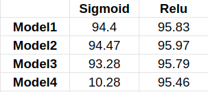
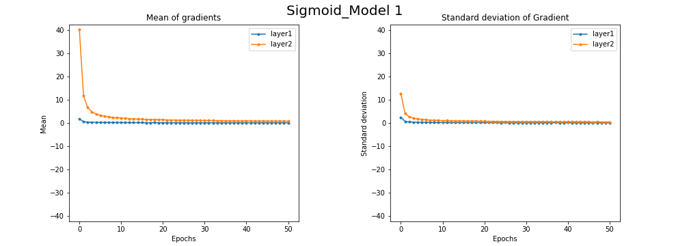
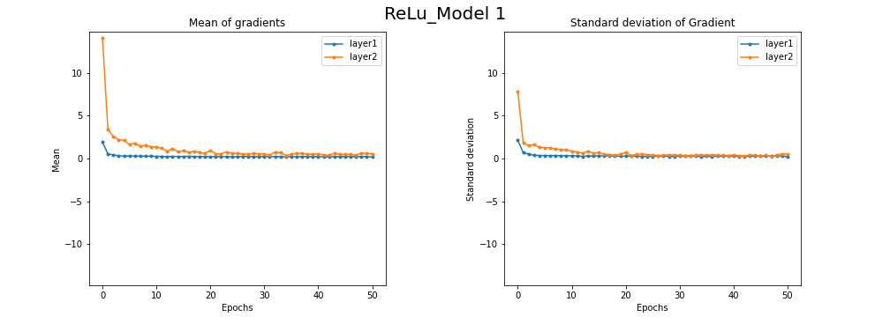
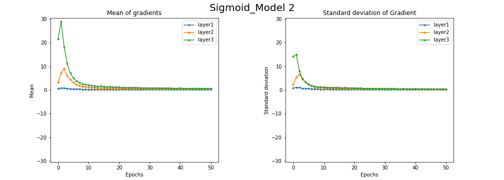
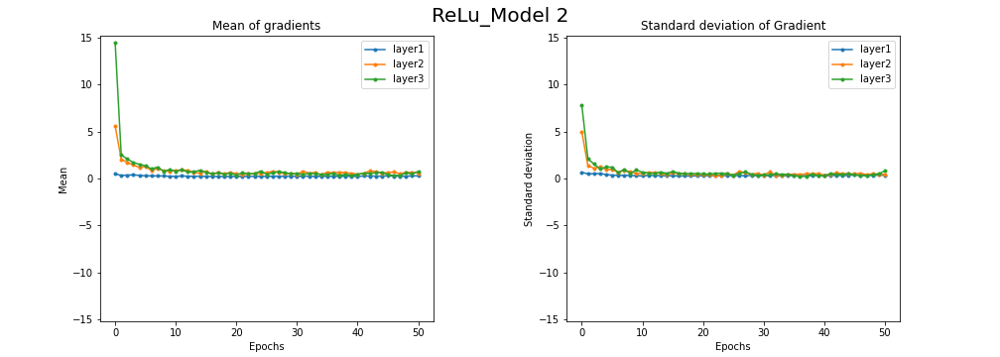
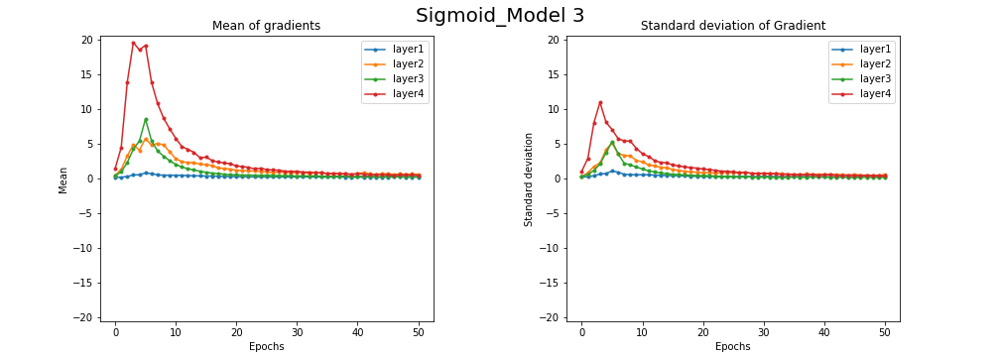
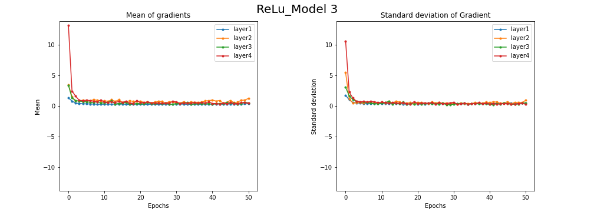
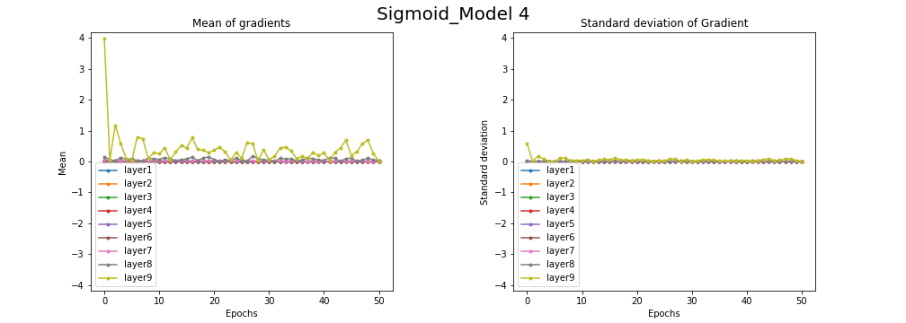
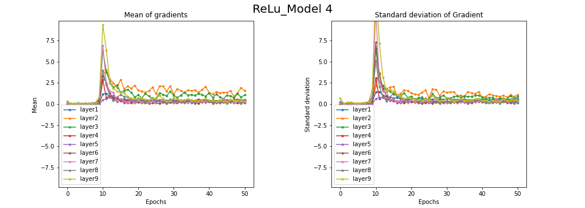

# Vanishing_Gradient
This repository helps in understanding vanishing gradient problem with visualization. 

Model 1 - 1 hidden layers with 20 neurons \\
Model 2 - 2 hidden layers with 20 neurons each \\
Model 3 - 3 hidden layers with 20 neurons each \\
Model 4 - 4 hidden ayers with 20 neurons each \\

The below table shows the accuracy value obtained by models using both activation functions

From the above table only accuracy of model4 is effected much due to the vanishing gradient problem caused by using sigmoid activation function. 

The mean and standard deiviation of gradients explain how the weights are being updated in the layers of model 

From the above plots of model1, model2 the use of sigmoid and Relu activation functions didn't show much difference in their weight update. 

In the model3 the relu activation function acheived convergence in its weight updates and there is not gradient change in its layers by observing the standard deiviation. However, the model4 with Relu activation function got high weight updates in its almost all layers but with sigmoid the vanishing gradient problem can be observed and resulted in less accuracy. 

